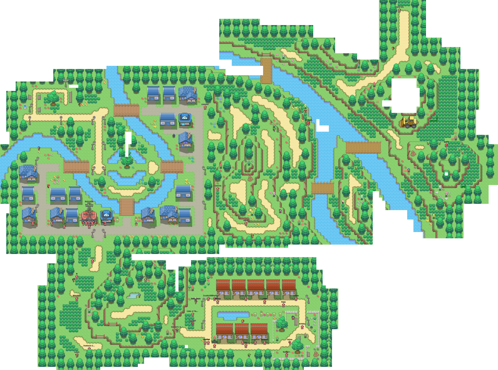
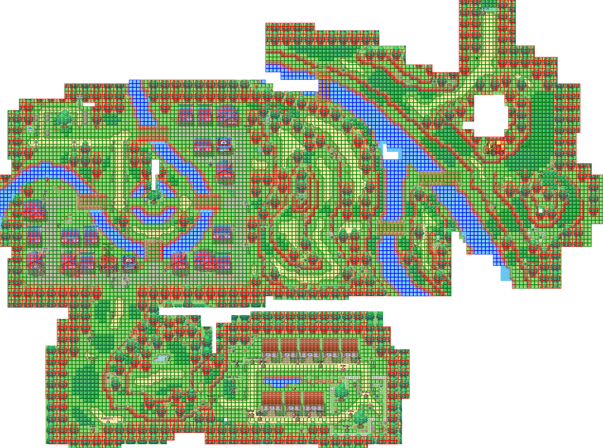

# Map

The map spans about 160 x 120 (starting coordinates at ~100). But there are huge unexplorable areas.

### Locations

The map has 3 Regions: City (top left), Forest (top right), and R1 (bottom left) with different spawning changes. There is a 4th part in the bottom right, a small village.

#### City

- Has 1 Cyber Center and 2 Shops and the tournament tree.
- The pond at (96/139 - 97/139) is the image for the glitchable Cybermon with ID 66.

### Forest

- The Loader truck at 217/143 is the image for the glitchable Cybermon with ID 67 (the image are actually 8? of those trucks). It is located at the top of a unpassable hill. Maybe it is a reference to the mysterious truck in Pokemon.
- To invisible borders block the player from exploring further: 163/117 and 216-219/107.
- The *Cool Guy* NPC at 198/169 is the strongest (verifiy) NPC. The tells that he lever looses, but this is not true.

### R1

- Nothing interesting here except some NPCs

### Village

- A beautiful village with several scenery elements, but no effect.

#### Map (open image in new tab for full scale view)

#### Map with collisioninfo and coordinates (still with some incorrect fields)

